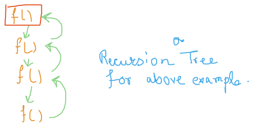
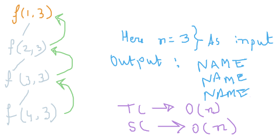
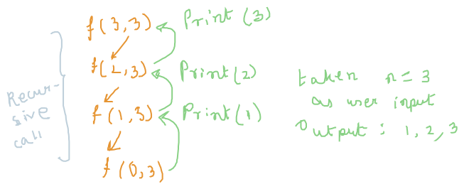

# Recursion
- When a function calls itself
- Until a SPECIFIC CONDITION is met

```
    void f(){
        print (1);
        f();
    }

    main{
        f();
    }

Infinite Recursion

In this case, while in Output, unlimited times 1 will be printed until Memory limit is reached called Stack Overflow condition is reached.

Error --> segmentation fault
```

```
    cnt=0;
    f(){
        if(cnt==4)
            return;

        print(cnt);
        cnt++;
        f();
    }

    main(){
        f();
    }

Condition that is used to stop the Recursion --> Base Condition
```

## Recursion Tree

The Recursion Tree Method is a way of solving recurrence relations. In this method, a recurrence relation is converted into recursive trees. Each node represents the cost incurred at various levels of recursion. To find the total cost, costs of all levels are summed up.

Steps to solve recurrence relation using recursion tree method:

- Draw a recursive tree for given recurrence relation
- Calculate the cost at each level and count the total no of levels in the recursion tree.
- Count the total number of nodes in the last level and calculate the cost of the last level
- Sum up the cost of all the levels in the recursive tree




## Basic Recursion Problems:
- Print Name 5 times.
- Print Lineasrly from 1 to N.
- Print form N to 1.
- Print Linearly from 1 to N (But by BackTrack).
- Print from N to 1 (But by BackTrack).

### Print Name 5 Times:
 ```
void f(i, n){
    if(i>n)
        return;
    
    print ("NAME");
    f(i+1, N);
}

main(){
    int n;
    cin >> n;
    f(1, n);
}
```


### Print Linearly from 1 to N (But by BackTrack). ==> f(i+1, N) is not allowed to use

```
f(i, N){
    if(i<1)
        return;
    
    f(i-1, N);
    print(i);
}

main(){
    cin >> N;
    f(N, N);
}

Input:
3
Output:
1 2 3
```


